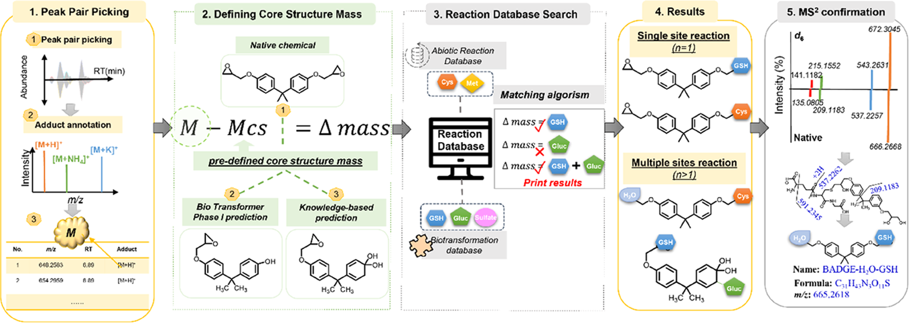

# **About**

  RTP (Reactive Compound Transformation Profiler) can automatically analyse pre-annotated LC-MS datasets and uncover probable transformation products for reactive compounds. Our platform is designed and developed based on our <a href="#paper">RTP paper</a>. Please refer to the <a href="./downloads">download</a> page for the links to our application, source codes, and sample dataset.

# **Abstract**

Reactive compounds, such as covalent toxicants/drugs, have their ubiquitous occurrences and are known to react with protein or DNA in human beings, but their reactions with endogenous metabolites are rarely understood. Currently, a viable platform is demanded for discovering their reaction products since their efficacy/toxicity may be altered after the reaction. We aim to develop a platform for identifying unknown abiotic or biotransformation products for these reactive compounds. Based on stable isotope-labeling (SIL) metabolomics, we have developed a novel and robust analytical platform, reactive compound transformation profiler (RTP), which can automatically analyze preannotated high-resolution mass spectrometry (LC-HRMS) data sets and uncover probable transformation products. Generally, RTP consists of four complementary steps: (1) selecting peak pairs of light and heavy-labeled products, (2) defining the “core structure mass” for possible reaction search, (3) constructing an endogenous metabolite reaction database, and (4) developing algorithms to propose the potential transformation products by searching against the database with a single-/multiple-site reaction. Its performance was validated using the reactive plasticizer bisphenol A diglycidyl ether (BADGE) in several sample matrices. This platform enabled the identification of novel transformation products while also demonstrating its capacity to filter out the false-positive signals and provide product annotation.

<figure>
  
  <figcaption style="text-align: center; font-style: italic; font-weight: bold">Illustration of the RTP workflow and the matching algorithm for identifying potential reaction products, with five substeps: (1) peak pair
picking and adduct annotation, (2) core structure mass definition, (3) reaction database search, (4) results print-out, and (5) MS2 confirmation.</figcaption>
</figure>

# **Paper**

Liu, M., Jiang, J., Zheng, J., Huan, T., Gao, B., Fei, X., ... & Fang, M. (2021). RTP: one effective platform to probe reactive compound transformation products and its applications for a reactive plasticizer BADGE. <i>Environmental Science & Technology</i>, 55(23), 16034-16043.

<a href="https://pubs.acs.org/doi/abs/10.1021/acs.est.1c05262">Online Paper</a> &nbsp; &nbsp; <a href="https://pubs.acs.org/doi/10.1021/acs.est.1c05262?goto=supporting-info">Supporting Information</a>
